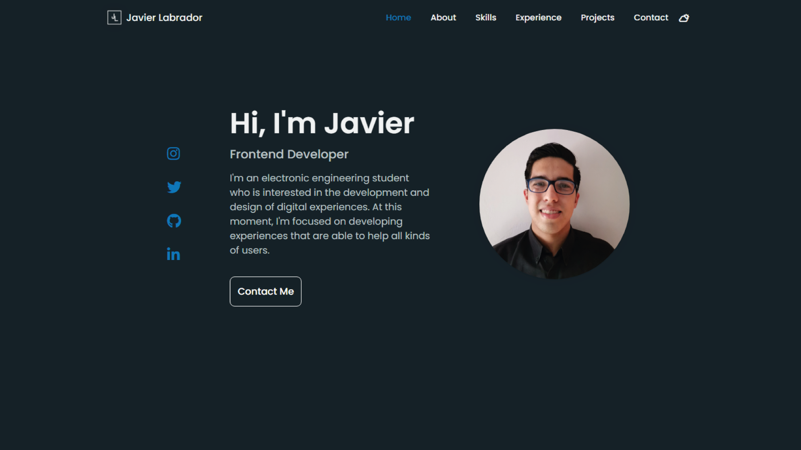

  

<h1 align="center">
  Javier Labrador - v1
</h1>

  The first version of my <a href="https://jalch0.github.io/my-portfolio-website-v1/index.html"> portfolio</a> built with HTML, CSS, JS.

## 💚 First Experience 

It is my first portfolio and there are some details that need to be polished, such as enabling the "Send message" button to make it work and adding more projects that I will add over time.

or who knows if I do a v2 😏
